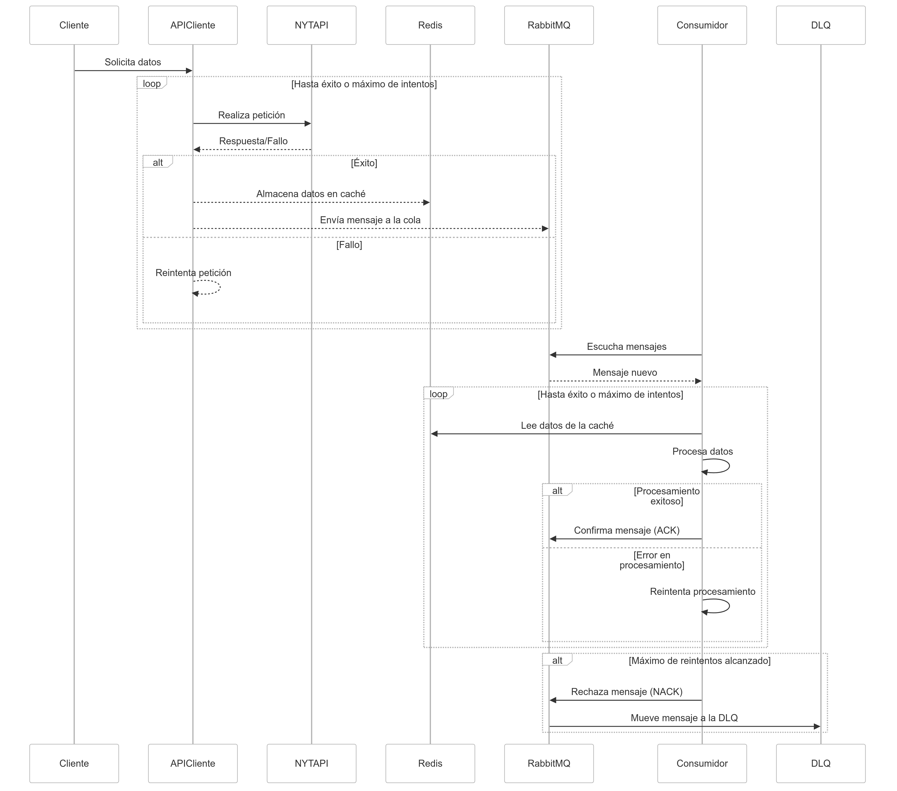

# Arquitectura

En este documento se describe la arquitectura del proyecto backend, proporcionando una visión general de sus componentes y cómo interactúan entre sí.

# Archivos importantes
### Arquitectura general

El proyecto backend está desarrollado en Python utilizando FastAPI como framework principal para la creación de APIs. La aplicación se estructura en múltiples capas y módulos que permiten una separación clara de responsabilidades y facilitan el mantenimiento y escalabilidad del sistema.
El sistema integra distintos servicios externos y tecnologías:
RabbitMQ: Utilizado como broker de mensajes para manejar la comunicación asíncrona entre componentes.
Redis: Empleado como sistema de caché para mejorar el rendimiento en la recuperación de datos.
FastStream: Librería utilizada para facilitar la creación y manejo de aplicaciones asíncronas.

### Diagrama de flujo

Nota: Este diagrama ilustra el flujo general de datos y operaciones dentro del sistema. Incluye la interacción entre el API, los consumidores y los servicios externos.

### Diagramas de secuencia adicionales

#### Integración con Amazon

Este diagrama muestra la posible integración con Amazon para buscar libros e incluir un botón de redirección a la página del producto.

#### Integración con O'Reilly

Este diagrama ilustra la posible integración con O'Reilly para obtener el precio de los libros técnicos.

# Mapa del código
A continuación se detalla la estructura del código del proyecto, resaltando los directorios y archivos más relevantes, así como las principales estructuras de datos y servicios.
### Directorios
- src/
Este directorio contiene el código fuente del proyecto y está organizado en las siguientes capas:
- books/: Contiene la lógica de negocio relacionada con los libros, incluyendo modelos, servicios y protocolos.
- core/: Incluye componentes compartidos y básicos del sistema, como infraestructuras, dominios y aplicaciones comunes.
- domain/: Define modelos y protocolos esenciales para el dominio de la aplicación.
infra/: Implementaciones concretas de interfaces y servicios, como el broker de mensajes y la integración con Redis.
- application/: Contiene casos de uso y servicios que orquestan la lógica de negocio.
- presentation/: Maneja la interacción con el mundo exterior, incluyendo APIs y consumidores.
- api/: Implementa los endpoints de la aplicación utilizando FastAPI.
- consumer/: Contiene los consumidores que manejan mensajes entrantes desde RabbitMQ.
Cada capa tiene su responsabilidad específica, siguiendo principios de arquitectura limpia o hexagonal.
- tests/
Este directorio alberga las pruebas del proyecto, divididas en:
- unit/: Pruebas unitarias que verifican la lógica de negocio en componentes individuales sin dependencias externas.
- integration/: Pruebas de integración que validan la interacción entre diferentes componentes y servicios externos.
- e2e/: Pruebas de extremo a extremo que simulan el comportamiento del usuario o cliente final.
### Estructuras de datos
- BookSchema
Ubicado en src/books/domain/schemas.py, BookSchema es un modelo Pydantic que representa la información de un libro. Incluye campos como título, descripción, autor, precio, ISBNs, entre otros.
- BooksSearchCriteriaSchema
Definido en src/books/domain/schemas.py, este esquema representa los criterios para buscar libros, como la lista, fecha de los más vendidos y offset.
- BooksService
Localizado en src/books/app/service.py, BooksService actúa como intermediario entre los casos de uso y los servicios de búsqueda de libros. Implementa métodos para buscar libros y listar géneros.
- método
- RabbitMQBroker
La implementación del broker de RabbitMQ se encuentra en src/core/infra/broker/rabbitmq/broker.py. Es responsable de establecer la conexión, declarar intercambios y colas, y manejar la publicación y suscripción de mensajes.
- cola
Proveedores de inyección de dependencias
Los proveedores de dependencias son esenciales para configurar y proporcionar las implementaciones concretas de interfaces y servicios.
- SettingsProvider: Ubicado en src/presentation/api/di/providers.py, agrupa las configuraciones necesarias del proyecto.
- InfrastructureProvider: También en src/presentation/api/di/providers.py, ofrece métodos para obtener instancias de servicios de infraestructura como el broker y servicios externos.
- Colas
El proyecto utiliza RabbitMQ para manejar la comunicación asíncrona entre componentes.
- book.queue
Esta cola es utilizada para publicar mensajes relacionados con la obtención y procesamiento de información de libros. Los productores envían mensajes a esta cola cuando se requiere procesar una solicitud de libros.
- book.queue.dlq
La "Dead Letter Queue" asociada, donde se envían los mensajes que no pudieron ser procesados exitosamente después de varios intentos.
Archivos importantes
- docker-compose.yml: Archivo de configuración en backend/docker-compose.yml para levantar los servicios necesarios del proyecto, incluyendo el backend, RabbitMQ y Redis.
- Dockerfile: Ubicado en backend/Dockerfile, define cómo construir la imagen Docker del backend.
- pyproject.toml: En backend/pyproject.toml, contiene las dependencias y configuraciones necesarias para el proyecto Python.
.gitignore: Especifica los archivos y directorios que deben ser ignorados por Git, localizado en backend/.gitignore.
### Notas adicionales
El proyecto sigue una arquitectura limpia o hexagonal, promoviendo la separación de preocupaciones y facilitando las pruebas y mantenibilidad.
Las tecnologías clave utilizadas incluyen:
- Python 3.12: Versión del lenguaje utilizada para aprovechar las últimas características y mejoras.
- FastAPI: Framework moderno para construir APIs con alto rendimiento.
- Structlog: Librería para el registro estructurado de logs.
- FastStream: Facilita la creación de aplicaciones asíncronas y manejo de flujos de datos.
- Redis y RabbitMQ: Tecnologías para caching y mensajería asíncrona, respectivamente.
La aplicación permite:
Integración con la API de libros del New York Times para obtener listas y detalles de libros.
- Cacheo de respuestas en Redis para mejorar el rendimiento.
- Uso de consumidores para procesar tareas en segundo plano y manejar reintentos en caso de fallos.